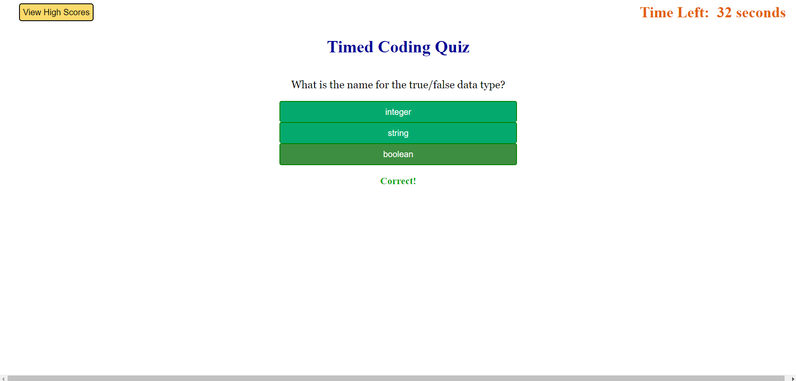

# Timed Coding Quiz

## Description

This simple, timed, multiple-shoice Coding Quiz webpage was created for the Module 04 Challenge assignment in my coursework for the Coding Bootcamp at UNC Chapel Hill.

This project challenged me greatly to use and expand my proficiencies with JavaScript functions, event listeners, methods, and browser localStorage functionality.

## Installation

To load and utilize this Coding Quiz, simply visit the following URL from any contemporary web browser connected to the internet, and follow the prompts:

## Usage

Upon visiting the landing page at the above URL, the user can either:

1) Click the "View High Scores" button to view the top 3 historical scores and corresponding user initials for the quiz on their computer, or 
2) Click the "Start" button to start the timer and begin answering the 5 multiple choice quiz questions by clicking on the answer they believe is correct. 

The timer starts counting down from a total 40 seconds (based on 8 seconds per question). The page will display an alert to the user letting them know whether they answered the previous question correctly or incorrectly. If a question is answered incorrectly and the timer still has more than 8 seconds remaining, 5 seconds are immediately subtracted from the remaining time. 

When either all questions have been answered, or the timer runs out, the quiz completes and shows the user their score, as well as a text input field for their initials and a "Save score and Try Again" button, which saves their initials and score to browser LocalStorage and brings the user back to the start page.

## Appearance

## Credits

To learn and implement the javascript functionality in this webpage, I referenced the following websites and tutorials extensively:

MDN JavaScript Reference page:
https://developer.mozilla.org/en-US/docs/Web/JavaScript

W3 Schools Javascript and HTML DOM Reference:
https://www.w3schools.com/jsref/default.asp

Javascript.info LocalStorage reference:
https://javascript.info/localstorage

## License

MIT License

Copyright (c) 2023 Peej D

Permission is hereby granted, free of charge, to any person obtaining a copy
of this software and associated documentation files (the "Software"), to deal
in the Software without restriction, including without limitation the rights
to use, copy, modify, merge, publish, distribute, sublicense, and/or sell
copies of the Software, and to permit persons to whom the Software is
furnished to do so, subject to the following conditions:

The above copyright notice and this permission notice shall be included in all
copies or substantial portions of the Software.

THE SOFTWARE IS PROVIDED "AS IS", WITHOUT WARRANTY OF ANY KIND, EXPRESS OR
IMPLIED, INCLUDING BUT NOT LIMITED TO THE WARRANTIES OF MERCHANTABILITY,
FITNESS FOR A PARTICULAR PURPOSE AND NONINFRINGEMENT. IN NO EVENT SHALL THE
AUTHORS OR COPYRIGHT HOLDERS BE LIABLE FOR ANY CLAIM, DAMAGES OR OTHER
LIABILITY, WHETHER IN AN ACTION OF CONTRACT, TORT OR OTHERWISE, ARISING FROM,
OUT OF OR IN CONNECTION WITH THE SOFTWARE OR THE USE OR OTHER DEALINGS IN THE
SOFTWARE.
